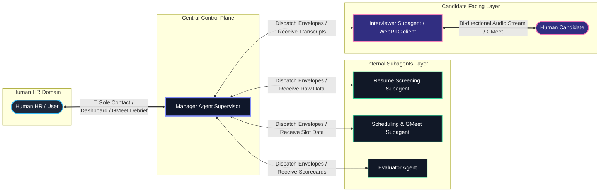
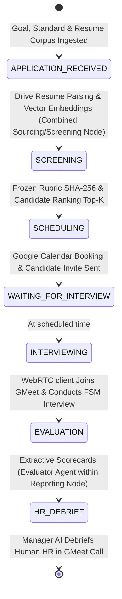

# TalentOps — High Level Design (HLD)

## 1. System Vision & Architecture Principles

**TalentOps** is an autonomous, multi-agent recruitment and multimodal candidate evaluation platform built with strict architectural boundary enforcement:

### 🔒 Strict Agent Hierarchy & Boundary Rules

1. **Manager Agent (Central Supervisor & Sole Human HR Liaison)**:
   - The **ONLY** point of contact for Human HR / Users.
   - Orchestrates the 6-stage recruitment lifecycle: `APPLICATION_RECEIVED` $\rightarrow$ `SCREENING` $\rightarrow$ `SCHEDULING` $\rightarrow$ `INTERVIEWING` $\rightarrow$ `EVALUATION` $\rightarrow$ `HR_DEBRIEF`.
   - Dispatches tasks to subagents via validated envelopes, collects raw evaluation data/transcripts, synthesizes executive candidate reports, and presents findings verbally in a dedicated Manager Debrief Google Meet session.

2. **Resume Screening Subagent (Internal)**:
   - Ingests candidate resumes (PDF/Docx), matches profile vectors against frozen JD rubrics ($\text{SHA-256}$), and reports candidate rankings **ONLY** to the Manager Agent.

3. **Scheduling & GMeet Subagent (Internal)**:
   - Integrates with Google Calendar FreeBusy API, creates Google Meet rooms, dispatches invitation emails, and reports meeting metadata **ONLY** to the Manager Agent.

4. **Interviewer Subagent (Candidate-Facing)**:
   - Joins Google Meet calls with Human Candidates using a WebRTC client.
   - Conducts two-way audio interviews over WebSockets / Gemini Live streaming, executes the 8-stage Interview FSM, logs verbatim audio transcripts, and sends raw logs **ONLY** to the Manager Agent.

5. **Evaluator Agent (Internal)**:
   - Evaluates verbatim transcript lines against frozen rubric competencies requiring exact quote evidence.
   - Bundled within the `reporting` node prior to HR_DEBRIEF.
   - Calculates demographic fairness metrics ($k$-anonymity with $k \ge 5$) and submits structured scorecards **ONLY** to the Manager Agent.

> 🔒 **CRITICAL ARCHITECTURE RULE**: Subagents NEVER interact with or report directly to Human HR. All subagent output flows upward exclusively to the Manager Agent.

---

## 2. Interaction Boundaries & Flow Diagram



---

## 3. Hexagonal Architecture (Ports & Adapters)

To decouple business logic from third-party vendor APIs, TalentOps implements Hexagonal Architecture:

```mermaid
graph TD
    subgraph Driving Adapters
        WebUI[React Frontend Command Center]
        RestApi[FastAPI REST API Routes]
        AudioWS[WebSocket Audio Transport /ws/audio]
    end

    subgraph Core Domain
        ManagerDomain[Manager Agent StateGraph Core]
        StageFSM[6-Stage Workflow FSM]
        InterviewerEngine[Interviewer FSM 8-Stage Lifecycle]
        RubricDomain[Rubric Engine SHA-256]
        ConfidenceGate[Confidence Gate & Human Escalation]
    end

    subgraph Driven Ports & Adapters
        DrivePort[Google Drive Ingestion Port] --> DriveAdapter[Google Drive API / Public Downloader]
        EmbedPort[Embedding Port] --> EmbedAdapter[OpenRouter / OpenAI / Supabase pgvector]
        CalendarPort[Calendar Booking Port] --> CalendarAdapter[Google Calendar API]
        EmailPort[Communication Port] --> EmailAdapter[SMTP / Gmail API Adapter]
        AudioPort[WebRTC Audio Bot Port] --> WebRTCAdapter[WebRTC Meet Chromium Bot Service]
        DatabasePort[Audit Storage Port] --> SupabaseAdapter[Supabase PostgreSQL Events & Scorecards]
    end

    Driving Adapters --> Core Domain
    Core Domain --> Driven Ports & Adapters
```

---

## 4. 6-Stage Recruitment Workflow Lifecycle



1. **`APPLICATION_RECEIVED`**: Ingests hiring goals, evaluation standards, and resume sources (Google Drive / PDFs).
2. **`SCREENING` (Combined with Sourcing)**: Parses PDFs, embeds candidate profiles into 384-dim unit vectors, freezes rubric content hash ($\text{SHA-256}$), and matches top candidates via Supabase `pgvector`.
3. **`SCHEDULING`**: Finds open calendar slots via Google Calendar API, books Google Meet rooms, and sends candidate invitation emails.
4. **`WAITING_FOR_INTERVIEW`**: Pauses workflow until the scheduled interview time.
5. **`INTERVIEWING`**: Deploys headless WebRTC client to candidate Meet call, streaming PCM audio over WebSockets through the 8-stage Interviewer FSM.
6. **`EVALUATION` (Bundled in Reporting Node)**: Evaluates transcript lines requiring exact verbatim quote evidence via the Evaluator Agent and computes demographic cohort fairness matrices ($k \ge 5$).
7. **`HR_DEBRIEF`**: Manager Agent synthesizes candidate report, generates a dedicated Manager Debrief Google Meet room, and verbally briefs Human HR.

---

## 5. Security & Compliance Architecture

- **Subagent Data Isolation**: Subagents have no direct exposure to external API routers serving Human HR.
- **Append-Only Audit Log**: Supabase `events` table enforces an append-only trigger (`events_block_mutation`), blocking `UPDATE` and `DELETE` actions.
- **Demographic Privacy ($k \ge 5$)**: Suppresses demographic statistics when sample size $n < 5$.
- **Architecture Decision Records**: See [docs/ADR.md](file:///Users/apple/TalentOops/docs/ADR.md) for ADR 001–005 details.
