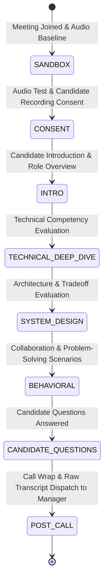

# TalentOps — Low Level Design (LLD)

## 1. Data Models & Type Specifications

### 1.1 Workflow State & Envelopes (`app/graph/`)

```python
from enum import Enum
from typing import Annotated, Any, Literal, TypedDict
from pydantic import BaseModel, Field
import operator

class WorkflowStage(str, Enum):
    APPLICATION_RECEIVED = "APPLICATION_RECEIVED"
    SCREENING = "SCREENING"
    SCHEDULING = "SCHEDULING"
    INTERVIEWING = "INTERVIEWING"
    EVALUATION = "EVALUATION"
    HR_DEBRIEF = "HR_DEBRIEF"
    COMPLETED = "COMPLETED"

class PipelineState(TypedDict, total=False):
    run_id: str
    goal: str
    standard: str
    stage: WorkflowStage
    next: str
    completed: Annotated[list[str], operator.add]
    messages: Annotated[list[dict], operator.add]
    rubric: dict[str, Any]
    candidates: list[dict]
    shortlist: list[dict]
    top_candidate: dict | None
    needs_review: bool
    corpus: list[dict] | None
    results: Annotated[dict[str, Any], operator.or_]
    report: dict[str, Any]

Party = Literal["manager", "sourcing", "screening", "scheduling", "interviewer", "evaluation", "reporting", "FINISH"]
EnvelopeKind = Literal["dispatch", "result", "finish", "escalation"]

class Envelope(BaseModel):
    sender: Party
    recipient: Party
    kind: EnvelopeKind
    body: dict[str, Any] = Field(default_factory=dict)
```

### 1.2 Frozen Rubric & Extractive Scorecards (`app/rubric/` & `app/agents/`)

```python
class Competency(BaseModel):
    name: str
    description: str
    weight: float = 1.0

class Rubric(BaseModel):
    run_id: str
    standard: str
    competencies: list[Competency]
    content_hash: str = ""

    def compute_content_hash(self) -> str:
        import hashlib, json
        canonical = json.dumps({
            "standard": self.standard,
            "competencies": [{"name": c.name, "desc": c.description, "w": c.weight} for c in self.competencies]
        }, sort_keys=True)
        return hashlib.sha256(canonical.encode("utf-8")).hexdigest()

class EvidenceQuote(BaseModel):
    quote: str
    char_start: int
    char_end: int
    speaker: Literal["candidate", "interviewer"]
    validated: bool

class CompetencyScore(BaseModel):
    competency_id: str
    demonstrated_level: Literal["L1", "L2", "L3", "insufficient_evidence"]
    evidence_quotes: list[EvidenceQuote] = Field(default_factory=list)

class ScorecardResult(BaseModel):
    candidate_id: str
    competencies: list[CompetencyScore]
    overall_fit: float
    needs_human_review: bool
```

---

## 2. Manager Agent & Subagent Prompt Templates

### 2.1 Manager Agent Executive HR Debrief Prompt (`app/agents/manager_debrief.py`)

```python
MANAGER_DEBRIEF_PROMPT = """
You are the Manager AI Agent, the executive supervisor and sole liaison to Human HR for hiring run {run_id}.
Synthesize the pipeline state and present a structured verbal briefing for Human HR:

Candidate: {top_candidate}
Position Goal: {goal}
Screening Match Score: {similarity_score}
Interview Verdict: {decision}

Briefing Structure:
1. Executive Summary & Hiring Recommendation
2. Key Competency Highlights backed by verbatim quotes
3. Screening & Vector Coverage Analysis
4. Fairness Audit & Escalation Flags (if any)
5. Q&A Readiness regarding transcript quotes and rubric criteria
"""
```

### 2.2 Extractive Scorecard Verification Prompt (`app/agents/evaluator_agent.py`)

```python
SCORECARD_VERIFICATION_PROMPT = """
You are the Candidate Evaluation Subagent. Evaluate the transcript lines against the frozen rubric competencies:
{competencies_json}

CRITICAL RULE: For every competency score assigned (0.0 to 1.0), you MUST output exact verbatim quotes from the candidate's responses in the transcript:
{transcript_lines}

If a quote cannot be verified verbatim from the transcript, flag the item as verbatim_match=False and set needs_review=True.
"""
```

---

## 3. Interviewer FSM 8-Stage Lifecycle (`app/agents/interviewer_fsm.py`)



### FSM State Transition Table

| Current FSM State | Input Cue / Condition | Next FSM State | Output Prompt Action |
| :--- | :--- | :--- | :--- |
| `SANDBOX` | Audio frame received | `CONSENT` | Prompt recording consent & mic test |
| `CONSENT` | Candidate confirms consent | `INTRO` | Present position overview |
| `INTRO` | Intro completed | `TECHNICAL_DEEP_DIVE` | Ask core technical question 1 |
| `TECHNICAL_DEEP_DIVE` | Tech Qs completed | `SYSTEM_DESIGN` | Present system architecture prompt |
| `SYSTEM_DESIGN` | Architecture completed | `BEHAVIORAL` | Ask behavioral situation prompt |
| `BEHAVIORAL` | Scenarios completed | `CANDIDATE_QUESTIONS` | Invite candidate questions |
| `CANDIDATE_QUESTIONS` | Questions completed | `POST_CALL` | Express thanks & close Meet call |
| `POST_CALL` | Call ended | `COMPLETED` | Dispatch raw transcript envelope to Manager |

---

## 4. Driving & Driven Ports Interfaces (Hexagonal Architecture)

### 4.1 Storage Port (`app/embeddings/store.py`)

```python
class DatabasePort(Protocol):
    def insert_event(self, run_id: str, source: str, event_type: str, payload: dict) -> None: ...
    def upsert_embedding(self, run_id: str, kind: str, ref_id: str, vector: list[float], metadata: dict) -> None: ...
    def match_embeddings(self, run_id: str, vector: list[float], kind: str, top_k: int) -> list[dict]: ...
```

### 4.2 Bot Service Port (`app/services/vexa_client.py`)

```python
class VexaBotPort(Protocol):
    async def join_meeting(self, meet_url: str, bot_name: str, voice_context: str, interview_id: str) -> dict: ...
    async def leave_meeting(self, meeting_id: str) -> dict: ...
```

---

## 5. API Contracts (REST & WebSockets)

### 5.1 `POST /run`
- **Request**: `{"goal": "Hire Senior Dev", "standard": "Python/FastAPI", "drive_url": "https://drive.google.com/..."}`
- **Response**: `{"run_id": "...", "final_state": {"stage": "HR_DEBRIEF", "top_candidate": "priya_rao", "report": {...}}}`

### 5.2 `@app.websocket("/ws/audio/{meeting_id}")`
- **Protocol**: Binary PCM 16kHz audio frames bi-directional stream.
- **Message Types**:
  - `{"type": "audio_frame", "data": "<base64_pcm>"}`
  - `{"type": "transcript_line", "speaker": "candidate", "text": "I used FastAPI..."}`
  - `{"type": "fsm_state_change", "from": "INTRO", "to": "TECHNICAL_DEEP_DIVE"}`
